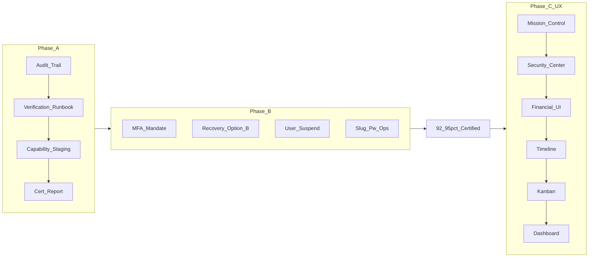

# Production Roadmap — Identity Certification ثم Productization

## السياق

Authority Layer, Reconciliation, RBAC, RLS, Load/DR/Security, UAT, Runtime Ops — **كلها موجودة ومُوثَّقة**.

**العائق الوحيد لشهادة Production اليوم:** Auditability في Authentication & Identity (6/10).

**بعد Phase A + B:** Authentication لن يكون نقطة ضعف — **92–95% Production Certified**.

---

## التقييم المعتمد

| Area | Score |
|------|-------|
| Billing Authority | 9.8/10 |
| Appointment Authority | 9.5/10 |
| Patient Authority | 9.3/10 |
| Inventory Authority | 9.0/10 |
| RBAC | 9.5/10 |
| Tenant Isolation | 9.5/10 |
| Operational Readiness | 8.8/10 |
| Authentication | 8.5/10 |
| **Auditability** | **6/10** ← Production Blocker |
| UX/Productization | 6.5/10 |

---

## قاعدة التسلسل

```text
❌ لا UX/Productization قبل إغلاق Phase A
❌ لا Go-Live قبل Phase A + B
✅ Phase C يبدأ بعد الشهادة الأمنية
```

---

## أكثر 5 عناصر حرجة

### 1. Identity Audit Trail — Production Blocker الحقيقي

سؤال Auditor: *"Show me all authentication events for Dr. Ahmed between Jan and Mar."*

اليوم: لا إجابة موثقة بالكامل (telemetry فقط).

بعد Phase A:

```sql
-- queryable من audit_logs
LOGIN_SUCCESS, LOGIN_FAILED, LOGOUT, PASSWORD_RESET_*,
MFA_*, ROLE_CHANGED, RECOVERY_CODE_USED, INVITE_ACCEPTED, USER_*
```

→ يغيّر تقييم Auditability بالكامل.

### 2. Recovery Code / AAL2 — أخطر نقطة تقنية

**قرار معتمد: Option B (مؤقتًا، قبل الإنتاج)**

```text
Recovery Code  → Login Allowed (dashboard access)
Privileged Action → Re-auth with TOTP (AAL2 via Supabase MFA verify)
```

**لا** sessionVersion AAL2 spoof عند recovery — UI و JWT و RPC يجب أن يتفقوا.

| | Option B (معتمد الآن) | Option A (بعد الإنتاج) |
|--|----------------------|------------------------|
| الجهد | يوم–يومين | Hook lifecycle + JWT customization + Supabase ops |
| النتيجة | يغلق الثغرة فورًا | JWT `aal: aal2` بعد recovery |

### 3. MFA للأدوار الحساسة — Baseline وليس ميزة

```text
doctor, accountant, pharmacist, lab_technician, clinic_admin, super_admin → Required
receptionist, nurse → Optional
```

### 4. User Suspension — أهم من SSO/Passkeys/HIBP الآن

```text
Suspend Employee → Reactivate Employee → Audit Employee
```

`profiles.account_status` (`active` | `suspended`)

### 5. Clinic Mission Control — أول UX بعد الشهادة

ليس Dashboard. يبرز: Reconciliation, Queue health, Financial integrity, Operational alerts, Notification failures.

---

## Phase A — K1 (~أسبوع)

> ترتيب التنفيذ **مهم** — Runbook قبل Capability Enforcement.

```text
A.1 Identity Audit Trail
A.2 Verification Runbook (+ baseline smoke)
A.3 Capability Enforcement (Staging only)
A.4 Certification Report
```

### A.1 Identity Audit Trail

| Event | Target |
|-------|--------|
| `LOGIN_SUCCESS` / `LOGIN_FAILED` / `LOGOUT` | Audit |
| `PASSWORD_RESET_REQUESTED` / `PASSWORD_RESET_COMPLETED` | Audit |
| `MFA_ENROLLED` / `MFA_REMOVED` / `MFA_CHALLENGE_FAILED` | Audit |
| `RECOVERY_CODE_USED` / `INVITE_ACCEPTED` / `ROLE_CHANGED` | Audit |
| `USER_SUSPENDED` / `USER_REACTIVATED` | Audit (RPCs في Phase B) |

Metadata: `tenant_id`, `user_id`, `actor_user_id`, `ip_address`, `user_agent`, `request_trace_id`

**تنفيذ:** `identityAudit.service.ts` + client hooks + server triggers/RPCs. `emitAuthMetric` بالتوازي.

**DoD:** *"Authentication is auditable."*

### A.2 Verification Runbook

**قبل** تفعيل capability enforcement — baseline موثّق لتفريق الأعطال:

**Automated:**
- `npm test` — rbacMatrix, authSessionOrchestrator
- `supabase test db` — rbac_certification_matrix, admin_super_admin_hardening

**Baseline smoke (document PASS قبل A.3):**
- Billing reconciliation panels
- Pharmacy workflows
- Lab amendment flows
- Runtime ops panels (`/admin/ops/runtime`, `/tenant/:slug/ops`)

**Manual (بعد A.1):**
- Login fail/success → `audit_logs`
- Logout, password reset, recovery code → audit query samples

قالب: [`docs/ops/auth-identity-cert-TEMPLATE.md`](docs/ops/)

### A.3 Capability Enforcement (Staging)

```env
VITE_RUNTIME_CAPABILITY_ENFORCE=true
```

**فقط في staging** — بعد A.2 baseline موثّق.

**لماذا بعد Runbook:** بدون baseline، regressions في billing/pharmacy/lab/ops لا يمكن تمييزها (enforcement جديد vs bug قديم).

**Production:** بعد staging smoke نظيف + تحديث A.4 report.

### A.4 Certification Report

[`docs/ops/auth-identity-cert-YYYY-MM-DD.md`](docs/ops/) — نفس مستوى billing / rbac / load certification.

يشمل: automated results, baseline smoke, audit query samples, capability enforce verdict, PASS/PARTIAL/GAP.

### Phase A Definition of Done

- [ ] 13 event في `audit_logs`
- [ ] Runbook + baseline smoke موثّق
- [ ] `VITE_RUNTIME_CAPABILITY_ENFORCE=true` staging (+ production في A.4)
- [ ] cert report موقّع

---

## Phase B — K2 (Production Blocker)

### B.1 MFA Mandatory Roles
→ 6 أدوار Required (انظر §5 أعلاه)

### B.2 Recovery / AAL2 — Option B

```text
MfaPage recovery success:
  → authMachineState: authenticated
  → sessionVersion: AAL1 tag (لا spoof)
  → privilegedAccessService: requires TOTP verify before privileged RPC
  → ReauthDialog / /mfa redirect for step-up
```

تحديث [`MFA_SECURITY_MODEL.md`](docs/MFA_SECURITY_MODEL.md) — Option A كـ Phase B+ backlog.

### B.3 User Suspension

`profiles.account_status` + `admin_suspend_user` / `admin_reactivate_user` + login block

### B.4 Tenant Slug Validation

Operational Integrity — [`ClinicLayout.tsx`](src/layouts/ClinicLayout.tsx) redirect

### B.5 Password Policy

`8 → 12` chars, length only

### B.6 Route Guard `/ops`

`manage_clinic | view_billing | manage_billing` في [`App.tsx`](src/App.tsx)

### Phase B Verification + DoD

- E2E pharmacist invite, staging adversarial, MFA mandate, Recovery Option B path
- تحديث cert report
- [ ] كل بنود B.1–B.6 مغلقة

---

## Phase C — UX/Productization

> **يبدأ بعد Phase A + B.** يُظهر backend موجود — لا منطق جديد.

### ترتيب الأولويات (معتمد)

| # | Screen | Route | الجمهور | القيمة |
|---|--------|-------|---------|--------|
| **C.1** | Clinic Mission Control | `/tenant/:slug/ops` | clinic_admin, accountant | Reconciliation, dead letters, alerts, queue/financial health |
| **C.2** | Identity & Security Center | `/tenant/:slug/security` | clinic_admin | يستهلك Phase A audit مباشرة |
| **C.3** | Financial Integrity UI | billing surfaces | accountant, clinic_admin | [`FinancialIntegrityPanel`](src/features/billing/FinancialIntegrityPanel.tsx) |
| **C.4** | Patient Timeline | patient detail | clinical roles | [`PatientTimeline`](src/features/patients/PatientTimeline.tsx) |
| **C.5** | Queue Kanban | appointments | receptionist, doctor | [`QueueKanbanBoard`](src/features/appointments/QueueKanbanBoard.tsx) |
| **C.6** | Dashboard Productization | dashboard | all | **آخر** — جميل لكن أقل ROI |

### C.1 Clinic Mission Control

توسيع [`ClinicMissionControlPage.tsx`](src/features/ops/ClinicMissionControlPage.tsx) بلوحات من [`RuntimeOpsPage.tsx`](src/features/admin/RuntimeOpsPage.tsx):

- Cross-domain reconciliation
- Notification dead letters / outbox
- Operational alerts
- Clinic-scoped audit tail

### C.2 Identity & Security Center (جديد)

```text
/tenant/:slug/security
```

**Authentication**
- MFA status per user / self
- Recovery codes status
- Last login / last failed login

**Users**
- Suspended users (من Phase B)
- Recent role changes
- Pending invites

**Audit** (query `audit_logs` من Phase A)
- `LOGIN_FAILED`, `PASSWORD_RESET_*`, `MFA_*`, `ROLE_CHANGED`

**Prerequisites:** Phase A audit + Phase B user suspension + MFA mandate

### C.3–C.6

Productization لشاشات موجودة — لا backend جديد.

---

## مؤجَّل (ليس Go-Live Blocker)

- SSO / SAML, HIBP, WebAuthn / Passkeys
- Admin MFA reset, session/device list
- **Option A** Custom Access Token Hook (بعد الإنتاج)
- Public signup policy

---

## خارطة الطريق



```text
Phase A  →  Authentication is auditable
Phase B  →  Authentication ليس نقطة ضعف
Phase C  →  Enterprise UX — إظهار القدرات المبنية
```

---

## ملفات مرجعية

- Auth: [`src/core/auth/`](src/core/auth/), [`src/services/auth/`](src/services/auth/)
- Ops: [`ClinicMissionControlPage.tsx`](src/features/ops/ClinicMissionControlPage.tsx), [`RuntimeOpsPage.tsx`](src/features/admin/RuntimeOpsPage.tsx)
- UX موجود: [`FinancialIntegrityPanel.tsx`](src/features/billing/FinancialIntegrityPanel.tsx), [`PatientTimeline.tsx`](src/features/patients/PatientTimeline.tsx), [`QueueKanbanBoard.tsx`](src/features/appointments/QueueKanbanBoard.tsx)
- MFA: [`docs/MFA_SECURITY_MODEL.md`](docs/MFA_SECURITY_MODEL.md)
- Cert peers: [`docs/ops/rbac-certification-matrix.md`](docs/ops/rbac-certification-matrix.md)
