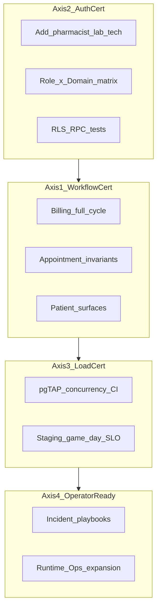

# Production Readiness Review

## السياق

موجات D→J أغلقت **Business Authority** على مستوى DB/commands/reconciliation. المرحلة التالية ليست features بل **إثبات** أن النظام يعمل تحت workflows حقيقية، أدوار متعددة، تحميل، وأخطاء تشغيل — كما وصفت.



**القرارات المعتمدة:**
- إضافة `pharmacist` و `lab_technician` إلى enum + RLS قبل بناء المصفوفة
- Load: **pgTAP concurrency في CI** + **staging scripts مع SLO assertions**

---

## المحور 1 — Business Workflow Certification

الهدف: كل workflow يُختبر كسلسلة واحدة مع تحقق cross-surface (Invoice ↔ Audit ↔ Events ↔ Outbox ↔ Reconciliation ↔ Runtime Ops).

### 1.1 Billing — دورة كاملة

**موجود:** [`supabase/tests/billing_post_payment_authority.sql`](supabase/tests/billing_post_payment_authority.sql) يثبت refund/reversal/write-off منفصلاً؛ [`transactional_billing_events.sql`](supabase/tests/transactional_billing_events.sql) للدفع؛ [`billing.service.coverage.test.ts`](src/services/__tests__/billing.service.coverage.test.ts) للـ create/pay/void فقط.

**فجوات:**

| فجوة | إجراء |
|------|--------|
| لا اختبار SQL لـ `command_invoice_lifecycle` | ملف جديد `supabase/tests/billing_invoice_lifecycle_authority.sql` — create → update → archive → restore → void-unpaid + idempotency |
| لا سلسلة واحدة Create→Partial→Partial→Refund→Reversal→WriteOff | توسيع `billing_post_payment_authority.sql` أو ملف `billing_full_workflow_certification.sql` — assert invoice balance، audit rows، domain_events، outbox count، reconciliation clean |
| Vitest لـ post-payment service | [`billing.service.ts`](src/services/billing/billing.service.ts): tests لـ `refundInvoice`, `reversePayment`, `writeOffInvoice` (mirror pgTAP) |
| Reconciliation findings post-payment غير مُختبرة | توسيع [`billing_reconciliation.sql`](supabase/tests/billing_reconciliation.sql) — `REFUND_OVER_PAID`, `PAYMENT_REVERSAL_MISMATCH`, `INVOICE_BALANCE_AFTER_REFUND_INVALID` (migration [`20260613101000_billing_reconciliation_post_payment.sql`](supabase/migrations/20260613101000_billing_reconciliation_post_payment.sql)) |
| `statePolicies` بدون unit tests | [`src/domain/workflows/__tests__/statePolicies.test.ts`](src/domain/workflows/statePolicies.ts) — billing refund/write-off paths |
| `repositoryDescribe` | [`repositoryDescribe.test.ts`](src/platform/runtime/certification/__tests__/repositoryDescribe.test.ts) — `assertCertifiedRepositoryDescribe` لـ billing + billingReconciliation |

**Cross-surface assertion pattern** (نموذج [`appointment_notification_trace.sql`](supabase/tests/appointment_notification_trace.sql)):

```sql
-- بعد كل خطوة: invoice.status, sum(payments), audit_logs.action,
-- domain_events.event_type, event_outbox.status, run_billing_reconciliation(...).critical_count = 0
```

### 1.2 Appointment — invariants + مسارات سلبية

**موجود:** [`appointment_operational_authority.sql`](supabase/tests/appointment_operational_authority.sql) يثبت cancel/no_show + "prevents cancelled plus active queue" (سطر ~393); Vitest في [`appointmentLifecycle.workflow.test.ts`](src/services/__tests__/appointmentLifecycle.workflow.test.ts); E2E happy path في [`tests/e2e/appointments-lifecycle.spec.ts`](tests/e2e/appointments-lifecycle.spec.ts).

**فجوات:**

| فجوة | إجراء |
|------|--------|
| لا appointment reconciliation | migration + `run_appointment_reconciliation` — findings: `COMPLETED_WITH_ACTIVE_QUEUE`, `CANCELLED_WITH_ACTIVE_QUEUE`, `NO_SHOW_WITH_WAITING_QUEUE`, queue/appointment status drift |
| pgTAP: `supabase/tests/appointment_queue_invariants.sql` | explicit negative asserts بعد complete/cancel/no_show — zero active queue rows |
| E2E cancel + no-show | توسيع `appointments-lifecycle.spec.ts` — مساران منفصلان |
| Notification trace في Vitest | integration test يستدعي lifecycle + يتحقق من delivery audit correlation (SQL proof موجود) |

### 1.3 Patient — lifecycle + surfaces

**موجود:** [`patient_operational_authority.sql`](supabase/tests/patient_operational_authority.sql), [`patient_visibility_surfaces.sql`](supabase/tests/patient_visibility_surfaces.sql), [`patientVisibility.test.ts`](src/services/patients/__tests__/patientVisibility.test.ts).

**فجوات:**

| فجوة | إجراء |
|------|--------|
| Vitest archive/restore/bulk | [`patient.service.test.ts`](src/services/__tests__/patient.service.test.ts) — archive blocked with active appts, restore clears deleted_at |
| Bulk archive | pgTAP scenario في `patient_operational_authority.sql` أو ملف dedicated |
| Dashboard + global search + exports | Vitest cross-surface: `searchGlobal`, `getOverview`, export RPCs — archived/deleted/legal-hold/retention |
| E2E patient lifecycle | Playwright spec جديد `tests/e2e/patient-lifecycle.spec.ts` |

**Definition of Done — Axis 1:** `npm run test:db` + `npm test` أخضر؛ كل workflow له pgTAP chain + Vitest service layer؛ تحديث [`docs/domain-certification-report.md`](docs/domain-certification-report.md) Workflow scores ≥ 90%.

---

## المحور 2 — Authorization Certification

الهدف: مصفوفة **Role × Domain × Action** قابلة للتدقيق، مع drift detection في CI.

### 2.1 توسيع الأدوار (قرارك: add_roles)

**Migration** `supabase/migrations/YYYYMMDD_add_pharmacist_lab_technician_roles.sql`:

```sql
ALTER TYPE public.app_role ADD VALUE IF NOT EXISTS 'pharmacist';
ALTER TYPE public.app_role ADD VALUE IF NOT EXISTS 'lab_technician';
```

**تحديثات متزامنة:**

| ملف | تغيير |
|-----|-------|
| [`src/core/auth/authStore.ts`](src/core/auth/authStore.ts) | `Role` type + `ROLE_PERMISSIONS` — pharmacist: `manage_pharmacy`, view patients; lab_technician: `manage_laboratory`, view patients/medical_records |
| [`src/domain/settings/roles.schema.ts`](src/domain/settings/roles.schema.ts) | `appRoleEnum` |
| [`src/features/settings/AddUserModal.tsx`](src/features/settings/AddUserModal.tsx) | inviteable roles |
| [`src/core/i18n/translations/en.ts`](src/core/i18n/translations/en.ts) + ar | display labels |
| RLS migrations pattern [`20260310093000_align_rbac_policies.sql`](supabase/migrations/20260310093000_align_rbac_policies.sql) | pharmacy write → pharmacist + clinic_admin; lab finalize/amend → lab_technician + clinic_admin |
| `assert_can_access_pharmacy()` / lab guards | توسيع [`20260424113000_subscription_entitlement_rls.sql`](supabase/migrations/20260424113000_subscription_entitlement_rls.sql) |

**إصلاح drift معروف:** procurement/inventory RLS حالياً tenant-only بينما client يتطلب `manage_pharmacy` — مواءمة RLS مع pharmacist role.

### 2.2 مصفوفة Certification

**مصدر الحقيقة:** [`docs/ops/rbac-certification-matrix.md`](docs/ops/rbac-certification-matrix.md) (جديد)

8 أدوار × 8 domains × 5 actions (Read, Write, Delete, Approve, Export):

| Domain | Read | Write | Delete | Approve | Export |
|--------|------|-------|--------|---------|--------|
| Patients | view_patients | manage_patients | clinic_admin | — | manage_clinic |
| Appointments | view_appointments | manage_appointments | clinic_admin | — | view_reports |
| Billing | view_billing | manage_billing | clinic_admin | accountant refund | view_reports |
| Insurance | view_billing | manage_billing | clinic_admin | clinic_admin claim approve | view_reports |
| Inventory | manage_pharmacy | manage_pharmacy | clinic_admin | — | view_reports |
| Labs | manage_laboratory | manage_laboratory | clinic_admin | lab finalize/amend | view_reports |
| Reports | view_reports | — | — | — | view_reports |
| Settings | manage_clinic | manage_clinic | super_admin | MFA step-up | super_admin |

(الجدول أعلاه draft — يُملأ من `ROLE_PERMISSIONS` + `assert_can_*` + RLS عند التنفيذ)

**CI enforcement:**

1. **`supabase/tests/rbac_certification_matrix.sql`** — pgTAP: لكل (role, domain, action) allowed/denied via `SET ROLE` + RPC/RLS probe (نمط [`rls_suite.sql`](supabase/tests/rls_suite.sql))
2. **`src/platform/authorization/__tests__/rbacMatrix.test.ts`** — Vitest: `ROLE_PERMISSIONS` + `capabilityMap` vs documented matrix (fail on drift)
3. **`tests/staging-auth/rbac-adversarial.spec.ts`** — توسيع [`rls-adversarial.spec.ts`](tests/staging-auth/rls-adversarial.spec.ts): cross-tenant + wrong-role RPC tampering لكل domain

**Definition of Done — Axis 2:** matrix doc + pgTAP + Vitest drift guard؛ pharmacist/lab_technician في enum + UI + RLS؛ zero undocumented permission grants.

---

## المحور 3 — Operational Load Certification

الهدف: إثبات invariants تحت concurrency (CI) + throughput/SLO (staging).

### 3.1 pgTAP Concurrency — CI (`npm run test:db`)

| Scenario | Target | Artifact |
|----------|--------|----------|
| Billing: 1000 payments | idempotency + no duplicate events/payments + reconciliation clean | `supabase/tests/load/billing_concurrent_payments.sql` — parallel sessions via `pg_background` أو loop + advisory locks simulating race |
| Appointments: 500 concurrent bookings | overlap constraint holds; exactly one winner per slot | `supabase/tests/load/appointment_concurrent_bookings.sql` |
| Inventory: 200 stock deductions | stock never negative; reservation integrity | `supabase/tests/load/inventory_concurrent_dispense.sql` — extend [`inventory_clinical_safety.sql`](supabase/tests/inventory_clinical_safety.sql) |
| Notifications: 5000 deliveries | outbox backlog bounded; no duplicate delivery keys | `supabase/tests/load/notification_delivery_throughput.sql` |

**Post-load assertions (كل ملف):**

```text
outbox backlog / dead_letter count
reconciliation critical_count = 0
recovery incident ledger (no orphaned workflows)
```

**Vitest companion:** [`tests/chaos/scenarios/chaos-scenarios.test.ts`](tests/chaos/scenarios/chaos-scenarios.test.ts) — استبدال stubs بـ orchestrator assertions بعد load SQL (where applicable).

### 3.2 Staging Game-Day Scripts

**توسيع** [`scripts/load-test.mjs`](scripts/load-test.mjs) → `scripts/load-cert/`:

| Script | Volume | SLO assertions |
|--------|--------|----------------|
| `billing-payments.mjs` | 1000 `post_invoice_payment` | p95 latency, zero duplicate payment rows, reconciliation tick |
| `appointment-bookings.mjs` | 500 parallel slot attempts | conflict rate, zero overlap violations |
| `inventory-deductions.mjs` | 200 `command_medication_dispense` | zero negative stock |
| `notification-deliveries.mjs` | 5000 `command_notification_delivery` | outbox drain time, dead letter = 0 |

**Monitor during run:** outbox summary RPC, `run_*_reconciliation` dry-run, Runtime Ops metrics (manual capture template in runbook).

**SLO doc:** تحديث [`docs/operations/production-rollout-checklist.md`](docs/operations/production-rollout-checklist.md) — thresholds + pass/fail gates.

**Definition of Done — Axis 3:** 4 pgTAP load files green in CI; staging scripts runnable with documented SLO pass criteria; quarterly game-day entry in [`tests/chaos/drill-runbook.md`](tests/chaos/drill-runbook.md).

---

## المحور 4 — Operator Readiness

الهدف: Support يحل الحوادث الشائعة من Runtime Ops + runbooks — **بدون features جديدة** (توثيق + wiring UI للـ reconciliation الموجود).

### 4.1 سيناريوهات 3AM — تقييم الجاهزية

| Incident | Runtime Ops today | Gap | Fix |
|----------|-------------------|-----|-----|
| Payment replay | Outbox replay + billing recon | Runbook step-by-step | [`docs/ops/playbooks/payment-replay.md`](docs/ops/playbooks/payment-replay.md) |
| Notification dead letter | Outbox table + replay | No admin alert; no DLQ table view | Playbook + surface dead_letter_events count in Runtime Ops header |
| Queue divergence | — | No appointment reconciliation UI | Playbook + wire `run_appointment_reconciliation` (Axis 1) into Ops |
| Inventory reservation conflict | — | No recon UI | Playbook referencing SQL findings + inventory recon (if added) |

### 4.2 Runbooks / Playbooks (جديد تحت `docs/ops/playbooks/`)

| Playbook | محتوى |
|----------|-------|
| `payment-replay.md` | Symptoms → forensic export → idempotency check → replay → dry recon → escalate |
| `notification-dead-letter.md` | DEAD_LETTER detection → delivery audit trace → replay → notification recon |
| `queue-divergence.md` | Completed+cancelled+active queue symptoms → appointment recon → manual close procedure |
| `inventory-reservation-conflict.md` | Orphan reservation → release command → stock verify |
| `reconciliation-triage.md` | Finding severity → acknowledge/investigate/resolve workflow (billing pattern) |

**ربط:** كل playbook يشير إلى أزرار Runtime Ops الفعلية في [`RuntimeOpsPage.tsx`](src/features/admin/RuntimeOpsPage.tsx).

### 4.3 Runtime Ops expansion (minimal wiring — no new domain logic)

**Reuse billing reconciliation panel pattern** for:

- Patient reconciliation — [`patientReconciliation.repository.ts`](src/services/patients/patientReconciliation.repository.ts) (already exists)
- Notification reconciliation — `run_notification_reconciliation` (DB exists, no TS repo yet — thin wrapper like billing)
- Appointment reconciliation — after Axis 1 migration

**Ops header additions:**

- Event outbox dead-letter count alert (parallel to billing findings severity)
- Cross-domain incident session grouping (already partially in timeline via `operationalEvidence.ts`)

**Admin dashboard:** extend [`admin.service.ts`](src/services/admin/admin.service.ts) alerts — `event_outbox_dead_letter_count` alongside `dead_letter_jobs_count`.

### 4.4 Chaos drill automation

Wire [`tests/chaos/injectors/`](tests/chaos/injectors/) into Playwright staging profile per [`drill-runbook.md`](tests/chaos/drill-runbook.md) scenarios 7–8 (payment replay + tenant switch) — post-drill: dry reconciliation assertion = 0 critical.

**Definition of Done — Axis 4:** 5 playbooks published; Runtime Ops shows patient + notification reconciliation; dead-letter visible; chaos scenarios 7–8 automated on staging.

---

## ترتيب التنفيذ

```text
Week 1: Axis 2 (roles) → Axis 1 billing gaps (foundation for load)
Week 2: Axis 1 appointments + patients → appointment reconciliation
Week 3: Axis 3 pgTAP load + staging scripts
Week 4: Axis 4 playbooks + Runtime Ops wiring + chaos automation
```

**تبعيات حرجة:**
- Axis 2 roles قبل RBAC matrix tests
- Axis 1 appointment reconciliation قبل queue-divergence playbook
- Axis 3 pgTAP قبل staging game-day (نفس invariants)

---

## معايير إغلاق Production Readiness

1. **Workflow:** 3 domains — full-cycle pgTAP + Vitest + (where applicable) E2E
2. **Auth:** 8 roles certified; CI drift guard; staging adversarial green
3. **Load:** 4 concurrency pgTAP suites + 4 staging scripts with documented SLO pass
4. **Ops:** 5 playbooks; 4 incident types resolvable from Runtime Ops without code deploy
5. **Report:** [`docs/domain-certification-report.md`](docs/domain-certification-report.md) updated — shift from "Near-certified" to "Production Readiness Review — Passed" per domain

**لا features جديدة** — فقط tests, docs, role expansion, reconciliation wiring, وOps surfacing.
