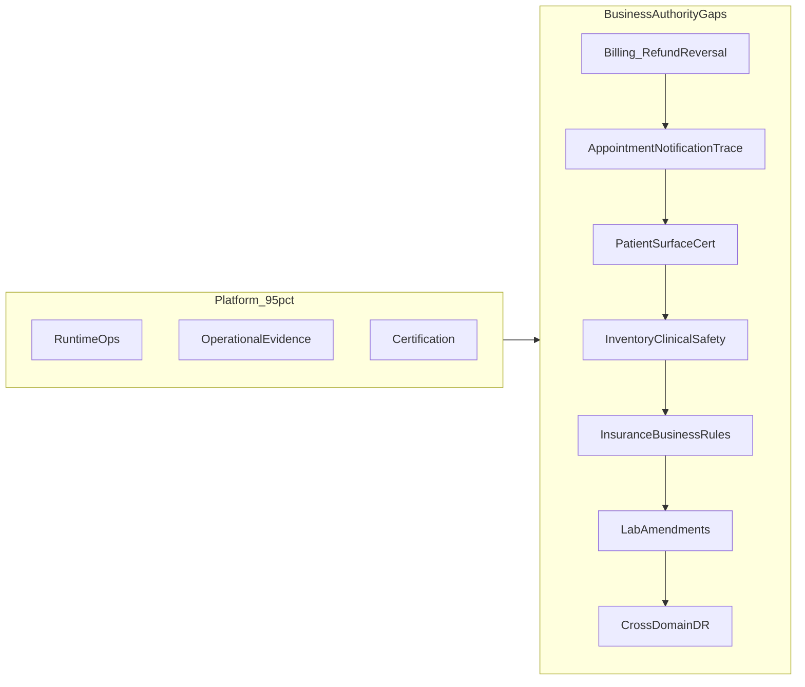
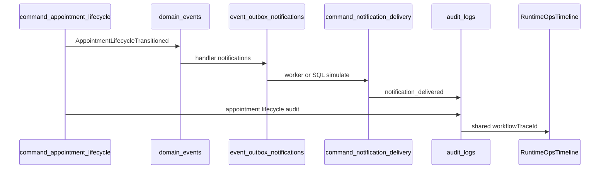

# خارطة موجات Production D→I

## تقييم الوضع الحالي (مُحدَّث عن التقرير)

تقييمك صحيح: المشروع تجاوز مرحلة "إضافة Features" إلى **إغلاق Business Authority Gaps**. التقرير في [`docs/domain-certification-report.md`](docs/domain-certification-report.md) (2026-06-07) **متأخر** في عدة نقاط:

| مجال | تقرير قديم | واقع الكود الآن |
|------|------------|-----------------|
| Billing create/void | "service-side" | **`command_invoice_lifecycle`** موجود ([`20260610100000_billing_invoice_lifecycle_authority.sql`](supabase/migrations/20260610100000_billing_invoice_lifecycle_authority.sql)) |
| Patients reconciliation | FAIL | **`run_patient_reconciliation`** + pgTAP ([`20260610120000_patient_operational_authority.sql`](supabase/migrations/20260610120000_patient_operational_authority.sql)) |
| Patient search/reports | PARTIAL | **`search_global` + `get_report_overview`** يستبعدان `deleted_at` ([`20260610121000_patient_report_visibility_hardening.sql`](supabase/migrations/20260610121000_patient_report_visibility_hardening.sql)) |
| Notifications | 64% | Wave C أغلقت command authority + **`run_notification_reconciliation`** ([`20260610122000_notification_authority_completion.sql`](supabase/migrations/20260610122000_notification_authority_completion.sql)) |

**ما يبقى فعلاً:** Post-payment corrections (refund/reversal/write-off)، إثبات cross-domain traces، invariants سريرية/تجارية، وChaos game-days.



---

## Wave D — Billing Refund/Reversal Authority (أعلى أولوية)

**الهدف:** إكمال دورة الفاتورة بعد الدفع — آخر جزء لجعل Billing Enterprise-grade.

### الوضع الحالي

- **قوي:** `post_invoice_payment` (partial/paid + outbox + idempotency) — [`20260510224000_transactional_billing_event_authority.sql`](supabase/migrations/20260510224000_transactional_billing_event_authority.sql)
- **جزئي:** `command_invoice_lifecycle` (create/update/archive/restore + void unpaid فقط) — [`20260610100000_billing_invoice_lifecycle_authority.sql`](supabase/migrations/20260610100000_billing_invoice_lifecycle_authority.sql)
- **ناقص:** refund, payment reversal, credit note, write-off
- **State machine:** `paid` terminal في [`src/domain/workflows/statePolicies.ts`](src/domain/workflows/statePolicies.ts) — لا مسار تصحيح
- **Exception مفتوحة:** [`billing.repository.ts`](src/services/billing/billing.repository.ts) `describe().exceptions`

### نطاق Wave D

**1. Migration جديدة** `20260613100000_billing_post_payment_authority.sql`:

| Command | سلوك |
|---------|------|
| `command_invoice_refund` | استرداد جزئي/كامل على `paid`/`partially_paid`؛ يرفض refund > amount_paid |
| `command_invoice_payment_reversal` | إلغاء صف `invoice_payments` محدد (compensating entry، ليس insert سالب مباشر — يتماشى مع [`src/platform/billing/invariants.ts`](src/platform/billing/invariants.ts)) |
| `command_invoice_write_off` (اختياري D أو D+) | شطب الرصيد غير القابل للتحصيل (م distinct عن void) |
| Credit note entity (اختياري) | جدول `invoice_credit_notes` مرتبط بالفاتورة المصدر إن احتاجت العيادة مستنداً رسمياً |

كل command: `SECURITY DEFINER` + idempotency + trace + audit + `create_domain_event` + outbox trigger.

**2. توسيع state machine** في [`statePolicies.ts`](src/domain/workflows/statePolicies.ts) و schema:
- حالات: `partially_refunded`, `refunded`, `written_off` (حسب قرار product)
- transitions من `paid` / `partially_paid` فقط عبر commands

**3. توسيع Reconciliation** — [`20260510120000_billing_reconciliation_authority.sql`](supabase/migrations/20260510120000_billing_reconciliation_authority.sql) pattern:
- Finding codes: `REFUND_OVER_PAID`, `PAYMENT_REVERSAL_MISMATCH`, `INVOICE_BALANCE_AFTER_REFUND_INVALID`
- certifying [`billingReconciliation.repository.ts`](src/services/billing/billingReconciliation.repository.ts) (`certified: true`, `capabilityAware: true`)

**4. Service layer (thin):**
- [`billing.service.ts`](src/services/billing/billing.service.ts): `refundInvoice`, `reversePayment`, `writeOffInvoice`
- إزالة/تقييد legacy `createPayment` direct insert في [`billing.repository.ts`](src/services/billing/billing.repository.ts)
- تسجيل events في [`src/core/events/event-types.ts`](src/core/events/event-types.ts): `InvoiceRefunded`, `PaymentReversed`

**5. Evidence (شرط الإغلاق):**
- SQL جديد: `supabase/tests/billing_post_payment_authority.sql` — refund, reversal, idempotency replay, tenant denial, over-refund rejection, outbox + audit trace
- SQL موجود: توسيع [`billing_reconciliation.sql`](supabase/tests/billing_reconciliation.sql)
- Vitest: [`billing.service.coverage.test.ts`](src/services/__tests__/billing.service.coverage.test.ts) + [`repositoryDescribe.test.ts`](src/platform/runtime/certification/__tests__/repositoryDescribe.test.ts)
- تحديث [`docs/domain-certification-report.md`](docs/domain-certification-report.md) — Billing → 92%+

**6. Ops (بدون UI جديد إن أمكن):** توسيع [`RuntimeOpsPage.tsx`](src/features/admin/RuntimeOpsPage.tsx) لعرض finding codes الجديدة (نفس نمط billing reconciliation الحالي).

### معايير إغلاق Wave D

- دورة كاملة مثبتة: Issue → Partial Pay → Paid → Refund/Reversal → Write-off
- لا `exceptions` في `billingRepository.describe()`
- pgTAP + Vitest + lint أخضر
- Reconciliation يكتشف drift post-payment

---

## Wave E — Appointment ↔ Notification End-to-End Certification

**الهدف:** إثبات trace واحد من lifecycle appointment إلى notification evidence وRuntime Ops.

### الفجوة

- [`appointment_operational_authority.sql`](supabase/tests/appointment_operational_authority.sql): يثبت outbox، **لا** notification
- [`notification_operational_authority.sql`](supabase/tests/notification_operational_authority.sql): يبدأ بـ domain event synthetic
- التقرير: "notification sequencing unproved" — [`docs/operations/appointment-notification-ordering.md`](docs/operations/appointment-notification-ordering.md) يصف intent فقط

### نطاق Wave E



**Deliverables:**
1. **`supabase/tests/appointment_notification_trace.sql`** — نموذج [`transactional_billing_events.sql`](supabase/tests/transactional_billing_events.sql): `check_in` → outbox → `command_notification_delivery` → assert `source_event_id`, `source_outbox_id`, shared `workflow_trace_id`
2. **Ordering test:** call → start → complete — لا duplicate delivery keys
3. **Worker path:** simulate `event_outbox_claim_batch` → deliver → complete (نمط [`event_outbox.sql`](supabase/tests/event_outbox.sql))
4. **Runtime Ops:** `evidenceFromNotificationDelivery()` في [`operationalEvidence.ts`](src/platform/runtime/semantics/operationalEvidence.ts) + wiring في [`RuntimeOpsPage.tsx`](src/features/admin/RuntimeOpsPage.tsx)
5. **قرار product (مطلوب قبل cert):** recipient = actor أم doctor/patient؟ lifecycle حالياً يوجّه للـ actor
6. **Metadata:** `appointmentRepository.describe()` → `evidenceAware: true` بعد الإثبات

**خارج النطاق (document only):** `AppointmentCreated` scheduling path (service-side emit) — weaker atomicity

---

## Wave F — Patient Search / Reporting Certification

**الهدف:** إثبات أن deleted/archived/retention-hold/legal-hold patients لا تظهر في search/reports/KPIs إلا حسب السياسة.

### الوضع الحالي

- DB/pgTAP: [`patient_operational_authority.sql`](supabase/tests/patient_operational_authority.sql) — search + report overview + reconciliation findings
- **ناقص:** Vitest cross-surface، TS reconciliation client، تحديث التقرير

### نطاق Wave F

1. **`supabase/tests/patient_visibility_surfaces.sql`** — deleted, inactive+deleted, legal-hold (يظهر في reconciliation لا في search/report), retention-expired
2. **Vitest regressions:** [`search.repository`](src/services/search/search.repository.ts), [`report.repository`](src/services/reports/report.repository.ts), patient list
3. **`patientReconciliation.repository.ts`** (نمط [`billingReconciliation.repository.ts`](src/services/billing/billingReconciliation.repository.ts)) — wire `run_patient_reconciliation`
4. **Optional scheduler:** pg_cron job (نمط billing) — operator-visible findings
5. **تحديث certification report:** Patients 74% → 88%+

---

## Wave G — Inventory Clinical Safety

**الهدف:** Reservation → Dispense → Deduct + expiry block + concurrency proof.

### الفجوات ([`domain-certification-report.md`](docs/domain-certification-report.md) #5)

- لا reservation model — [`adjust_medication_stock`](supabase/migrations/20260521150000_domain_operational_authority.sql) فقط
- `medication_batches.expiry_date` موجود، لا dispense path
- لا concurrent test (50 parallel deductions)

### نطاق Wave G

**Migration** `20260614100000_inventory_clinical_safety.sql`:

| Command | Purpose |
|---------|---------|
| `command_medication_reserve` | حجز من prescription → `reserved_quantity` |
| `command_medication_dispense` | dispense from batch؛ **يرفض expired batch** |
| `command_medication_release` | إلغاء حجز |

**Schema:** `medication_reservations`, extend `inventory_movements` type `dispense`

**Tests:**
- `supabase/tests/inventory_clinical_safety.sql` — expiry rejection, reservation→dispense flow
- **Concurrency:** pgTAP parallel sessions أو dedicated stress script — stock never negative
- Reconciliation: `run_inventory_reconciliation` (stock drift, orphan reservations)

---

## Wave H — Insurance Business Certification

### نطاق Wave H

**Migration** `20260615100000_insurance_business_authority.sql`:

1. **Duplicate claim prevention:**
   - Unique partial index أو command guard: `(tenant_id, patient_id, service, claim_date, encounter_id)` where status not in (denied, void)
   - pgTAP: second create → `CONFLICT`

2. **Coverage validation before submit:**
   - جدول `insurance_coverage_policies` (tenant, payer, service codes, active window)
   - `command_insurance_claim` op `submit`: validate coverage exists + active + service covered
   - pgTAP + [`insurance.service.test.ts`](src/services/__tests__/insurance.service.test.ts)

3. **Optional:** `run_insurance_reconciliation` — duplicate drift, orphan claims

---

## Wave I — Lab Amendment Authority

### نطاق Wave I

**Migration** `20260616100000_lab_amendment_authority.sql` — نموذج [`command_medical_record_lifecycle('amend')`](supabase/migrations/20260610120000_patient_operational_authority.sql):

- `lab_result_versions` table (immutable rows: v1, v2, v3)
- `command_lab_result_amend` — post-finalization correction؛ audit `previous`/`current`؛ لا overwrite in-place
- pgTAP: amend chain + idempotency + tenant denial
- Reconciliation: finalized-without-version, orphan amendments

---

## Wave J — Cross-Domain Disaster Recovery Certification

*(موجة إضافية بعد اكتمال الدومينات — كما اقترحت)*

**النمط المرجعي:** [`billingReconciliation.ts`](src/services/billing/billingReconciliation.ts) + [`recoveryOrchestrator.ts`](src/platform/runtime/recovery/recoveryOrchestrator.ts) + [`tests/chaos/drill-runbook.md`](tests/chaos/drill-runbook.md)

| Scenario | Domains | Artifact |
|----------|---------|----------|
| payment → crash → replay → reconcile | Billing | Automated pgTAP + Vitest chaos matrix |
| check-in → crash → retry | Appointment + Notification | `appointment_notification_trace.sql` + worker retry |
| archive → tenant switch → retry | Patient | reconciliation + stale epoch test |
| delivery failure → retry → dead letter | Notification | extend [`event_outbox.sql`](supabase/tests/event_outbox.sql) |

**Infrastructure:** wire [`tests/chaos/injectors/`](tests/chaos/injectors/) into Playwright staging profile (item مفتوح في platform roadmap).

---

## ترتيب التنفيذ والتبعيات

```text
Wave D (Billing post-payment)     ← لا تبعيات؛ أعلى ROI
    ↓
Wave E (Appt↔Notification trace)  ← يعتمد على notification authority (Wave C ✓)
    ↓
Wave F (Patient surfaces)         ← DB جاهز؛ mostly proof + TS wiring
    ↓
Wave G (Inventory clinical)       ← independent؛ high clinical risk
Wave H (Insurance business)       ← independent
Wave I (Lab amendments)           ← independent
    ↓
Wave J (Cross-domain DR)          ← بعد إغلاق commands في D–I
```

**يمكن تشغيل G/H/I بالتوازي** بعد Wave E إن كان الفريق > 1.

---

## Definition of Done لكل موجة

1. Migration(s) + RPC commands
2. `supabase/tests/*.sql` pgTAP proof
3. Vitest service/repository tests
4. `describe()` metadata بدون exceptions (أو exceptions مُبررة)
5. تحديث [`docs/domain-certification-report.md`](docs/domain-certification-report.md)
6. `npm run test:db` + `npm test` + `npm run lint`

---

## Wave D — خطوات التنفيذ الأولى (عند الموافقة)

1. تصميم state machine post-payment (product sign-off على credit note vs write-off)
2. كتابة migration `20260613100000_billing_post_payment_authority.sql`
3. SQL tests `billing_post_payment_authority.sql`
4. Service/repository wiring + reconciliation findings
5. إزالة exception من `billingRepository.describe()`
6. تحديث certification report + verification suite
